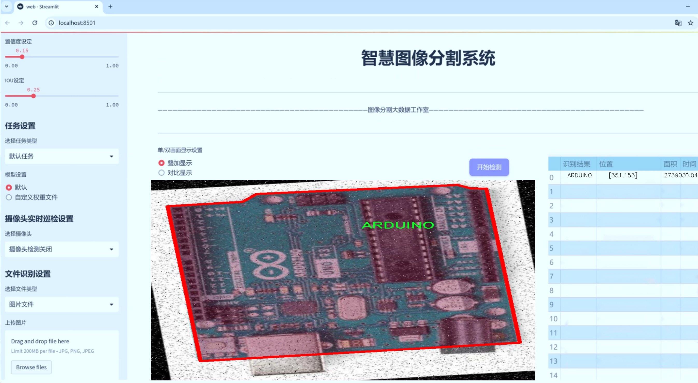
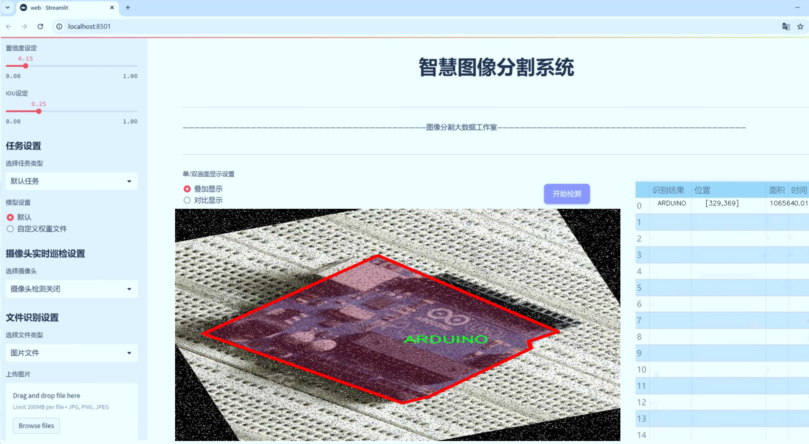
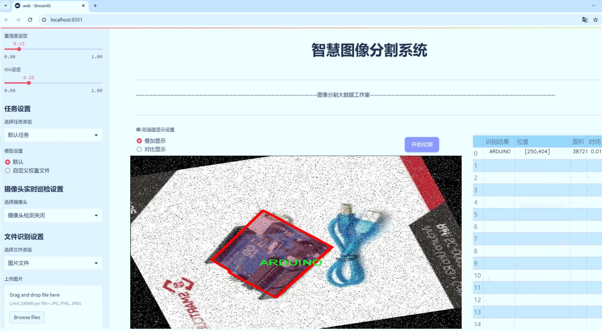
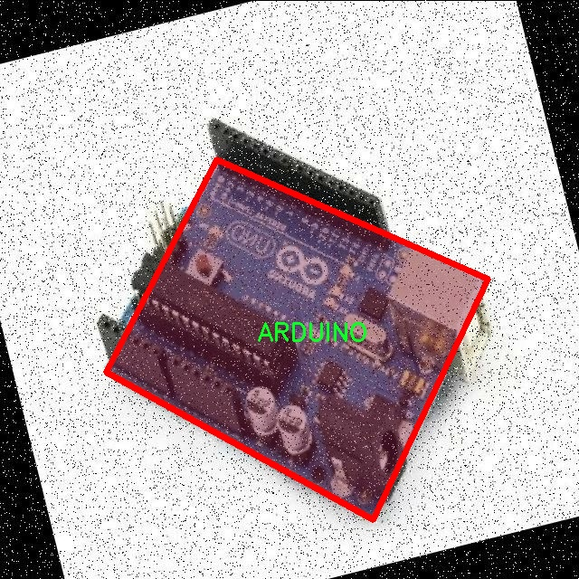
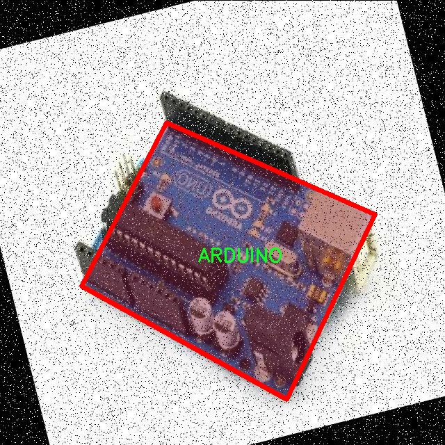
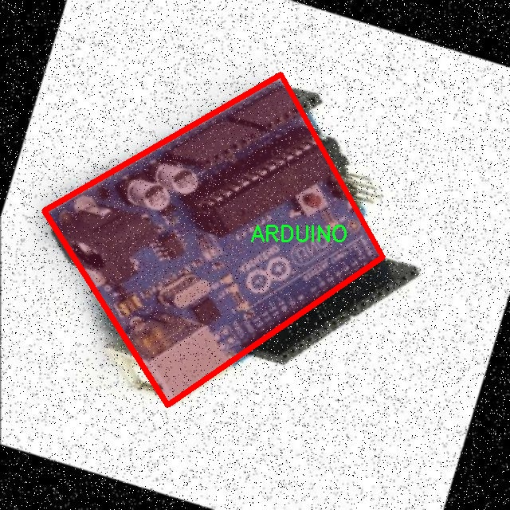
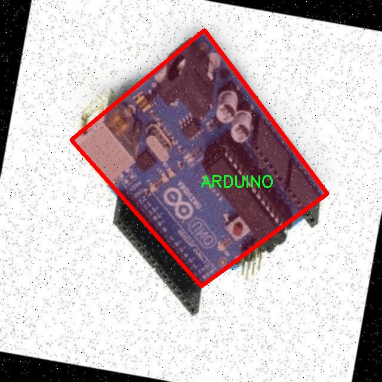
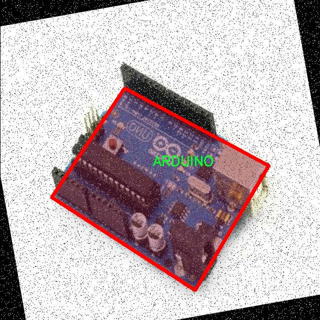

# 电路板图像分割系统源码＆数据集分享
 [yolov8-seg-C2f-DCNV2-Dynamic＆yolov8-seg-RepHGNetV2等50+全套改进创新点发刊_一键训练教程_Web前端展示]

### 1.研究背景与意义

项目参考[ILSVRC ImageNet Large Scale Visual Recognition Challenge](https://gitee.com/YOLOv8_YOLOv11_Segmentation_Studio/projects)

项目来源[AAAI Global Al lnnovation Contest](https://kdocs.cn/l/cszuIiCKVNis)

研究背景与意义

随着电子技术的迅猛发展，电路板在现代电子设备中的应用愈加广泛，成为了信息技术、智能硬件及物联网等领域的核心组成部分。电路板的设计与制造过程复杂，涉及到多种元器件的布局与连接。为了提高电路板的生产效率与质量，自动化检测与分割技术逐渐成为研究的热点。图像分割技术在这一领域的应用尤为重要，它能够有效地识别和分离电路板上的不同元器件，从而为后续的自动化检测、故障分析及维护提供支持。

在众多图像分割算法中，YOLO（You Only Look Once）系列因其高效的实时检测能力而备受关注。YOLOv8作为该系列的最新版本，结合了深度学习的先进技术，展现出了卓越的性能。然而，传统的YOLOv8模型在处理电路板图像时，仍然面临着一些挑战，例如在复杂背景下的目标遮挡、不同元器件的相似性以及图像分辨率的限制等。因此，基于改进YOLOv8的电路板图像分割系统的研究具有重要的理论价值和实际意义。

本研究所使用的数据集包含1700张电路板图像，涵盖了三类元器件：Arduino、Bboard和LED。这一数据集的构建为模型的训练与验证提供了丰富的样本支持。通过对不同类别元器件的特征进行深入分析，研究者可以更好地理解各类元器件在图像中的表现形式及其分布特征，从而为改进YOLOv8模型提供依据。针对电路板图像的特定特点，研究者可以在模型结构、损失函数及数据增强等方面进行创新，以提升模型的分割精度和鲁棒性。

此外，电路板图像分割系统的研究不仅有助于提高电路板的自动化检测效率，还能够推动智能制造和工业4.0的发展。通过实现对电路板元器件的精准识别与分割，相关企业可以大幅降低人工检测的成本，提高生产线的自动化水平。同时，该系统的应用还可以减少因人为因素导致的错误，提高产品的整体质量，进而增强企业的市场竞争力。

综上所述，基于改进YOLOv8的电路板图像分割系统的研究，不仅具有重要的学术价值，也为实际应用提供了新的思路与方法。通过深入探索电路板图像分割技术，研究者能够为智能制造领域的发展贡献力量，同时推动计算机视觉技术在电子行业的广泛应用。这一研究的开展，将为未来的电路板检测、故障诊断及维护提供坚实的技术基础，具有深远的社会与经济意义。

### 2.图片演示







##### 注意：由于此博客编辑较早，上面“2.图片演示”和“3.视频演示”展示的系统图片或者视频可能为老版本，新版本在老版本的基础上升级如下：（实际效果以升级的新版本为准）

  （1）适配了YOLOV8的“目标检测”模型和“实例分割”模型，通过加载相应的权重（.pt）文件即可自适应加载模型。

  （2）支持“图片识别”、“视频识别”、“摄像头实时识别”三种识别模式。

  （3）支持“图片识别”、“视频识别”、“摄像头实时识别”三种识别结果保存导出，解决手动导出（容易卡顿出现爆内存）存在的问题，识别完自动保存结果并导出到tempDir中。

  （4）支持Web前端系统中的标题、背景图等自定义修改，后面提供修改教程。

  另外本项目提供训练的数据集和训练教程,暂不提供权重文件（best.pt）,需要您按照教程进行训练后实现图片演示和Web前端界面演示的效果。

### 3.视频演示

[3.1 视频演示](https://www.bilibili.com/video/BV17Z1YYVEKK/)

### 4.数据集信息展示

##### 4.1 本项目数据集详细数据（类别数＆类别名）

nc: 3
names: ['ARDUINO', 'Bboard', 'LED']


##### 4.2 本项目数据集信息介绍

数据集信息展示

在现代电子设备的设计与制造过程中，电路板的图像分割技术日益成为一项重要的研究领域。为了提升电路板图像分割系统的性能，尤其是在YOLOv8-seg模型的应用中，构建一个高质量的数据集显得尤为关键。本研究所采用的数据集名为“Combined”，其专门针对电路板图像分割任务进行了精心设计和构建。

“Combined”数据集包含了三种主要类别，分别是“ARDUINO”、“Bboard”和“LED”。这些类别的选择不仅涵盖了电路板中常见的元件类型，还为模型的训练提供了丰富的样本。这三类对象在电路板上具有不同的形状、颜色和尺寸特征，使得模型在进行图像分割时能够学习到多样化的特征，从而提高其泛化能力。

首先，ARDUINO类别代表了广泛应用于电子项目中的微控制器模块。该类别的图像样本通常展示了具有特定形状和引脚排列的电路板，包含了丰富的细节信息，如电源接口、输入输出端口等。这些特征不仅有助于模型识别和分割出ARDUINO模块，还能帮助其理解模块在电路板上的布局和功能。

其次，Bboard类别则指代电路板的基础结构，通常是用于连接和支撑其他电子元件的底板。Bboard的图像样本可能展示了不同的层次和复杂的线路设计，具有较高的复杂性。通过对Bboard的有效分割，模型能够更好地理解电路板的整体结构，为后续的元件识别和功能分析奠定基础。

最后，LED类别代表了电路板上常见的发光二极管。这些元件在电路板上通常以特定的排列方式出现，具有鲜明的颜色和形状特征。通过对LED的准确分割，模型不仅能够识别出其位置，还能为后续的故障检测和性能评估提供重要的数据支持。

“Combined”数据集的构建过程经过了严格的筛选和标注，确保每一类样本都具有高质量的图像和准确的标注信息。这一过程不仅提升了数据集的可靠性，也为模型的训练提供了坚实的基础。通过对这些多样化样本的学习，YOLOv8-seg模型能够有效地捕捉到电路板图像中的关键特征，进而实现高效的图像分割。

在训练过程中，数据集的多样性和丰富性使得模型能够在不同的场景和条件下进行学习，增强了其对未知数据的适应能力。这一优势在实际应用中尤为重要，因为电路板的设计和布局往往具有高度的个性化和复杂性。

综上所述，“Combined”数据集为改进YOLOv8-seg的电路板图像分割系统提供了重要的支持。通过对ARDUINO、Bboard和LED这三类对象的深入学习，模型不仅能够实现高效的图像分割，还能为电路板的设计、制造和维护提供更为精准的数据分析和决策支持。











### 5.全套项目环境部署视频教程（零基础手把手教学）

[5.1 环境部署教程链接（零基础手把手教学）](https://www.bilibili.com/video/BV1jG4Ve4E9t/?vd_source=bc9aec86d164b67a7004b996143742dc)


[5.2 安装Python虚拟环境创建和依赖库安装视频教程链接（零基础手把手教学）](https://www.bilibili.com/video/BV1nA4VeYEze/?vd_source=bc9aec86d164b67a7004b996143742dc)

### 6.手把手YOLOV8-seg训练视频教程（零基础小白有手就能学会）

[6.1 手把手YOLOV8-seg训练视频教程（零基础小白有手就能学会）](https://www.bilibili.com/video/BV1cA4VeYETe/?vd_source=bc9aec86d164b67a7004b996143742dc)


按照上面的训练视频教程链接加载项目提供的数据集，运行train.py即可开始训练



     Epoch   gpu_mem       box       obj       cls    labels  img_size
     1/200     0G   0.01576   0.01955  0.007536        22      1280: 100%|██████████| 849/849 [14:42<00:00,  1.04s/it]
               Class     Images     Labels          P          R     mAP@.5 mAP@.5:.95: 100%|██████████| 213/213 [01:14<00:00,  2.87it/s]
                 all       3395      17314      0.994      0.957      0.0957      0.0843

     Epoch   gpu_mem       box       obj       cls    labels  img_size
     2/200     0G   0.01578   0.01923  0.007006        22      1280: 100%|██████████| 849/849 [14:44<00:00,  1.04s/it]
               Class     Images     Labels          P          R     mAP@.5 mAP@.5:.95: 100%|██████████| 213/213 [01:12<00:00,  2.95it/s]
                 all       3395      17314      0.996      0.956      0.0957      0.0845

     Epoch   gpu_mem       box       obj       cls    labels  img_size
     3/200     0G   0.01561    0.0191  0.006895        27      1280: 100%|██████████| 849/849 [10:56<00:00,  1.29it/s]
               Class     Images     Labels          P          R     mAP@.5 mAP@.5:.95: 100%|███████   | 187/213 [00:52<00:00,  4.04it/s]
                 all       3395      17314      0.996      0.957      0.0957      0.0845


### 7.50+种全套YOLOV8-seg创新点代码加载调参视频教程（一键加载写好的改进模型的配置文件）

[7.1 50+种全套YOLOV8-seg创新点代码加载调参视频教程（一键加载写好的改进模型的配置文件）](https://www.bilibili.com/video/BV1Hw4VePEXv/?vd_source=bc9aec86d164b67a7004b996143742dc)

### 8.YOLOV8-seg图像分割算法原理

原始YOLOv8-seg算法原理

YOLOv8-seg算法是YOLO系列中的一个重要进展，专注于目标检测与分割任务的高效结合。该算法在YOLOv5的基础上进行了深度优化，旨在提高检测精度和推理速度，同时保持模型的轻量化特性。YOLOv8-seg的设计理念是将目标检测与实例分割有机结合，使得模型不仅能够识别目标的类别，还能精确地分割出目标的轮廓，满足更复杂的应用需求。

YOLOv8-seg的网络结构主要由输入层、骨干特征提取网络、特征融合网络和检测头组成。输入层负责对输入图像进行预处理，包括图像的缩放、归一化以及数据增强等操作。在YOLOv8-seg中，Mosaic数据增强被引入以提升模型的鲁棒性，但在训练的最后阶段则会停止使用，以避免对数据分布的破坏。该设计反映了对数据质量的重视，确保模型能够学习到更真实的特征。

在骨干特征提取网络中，YOLOv8-seg采用了C2f模块替代了传统的C3模块。C2f模块的设计灵感来源于YOLOv7中的ELAN结构，通过引入更多的跳层连接，增强了梯度流动，使得特征提取更加高效。该模块的轻量化特性不仅提高了计算效率，还在一定程度上减少了模型的参数量，适应了移动设备和边缘计算的需求。此外，SPPF模块的保留使得特征图的处理更加灵活，通过不同内核尺寸的池化操作，进一步提升了特征图的表达能力。

特征融合网络是YOLOv8-seg的核心部分，结合了特征金字塔网络（FPN）和路径聚合网络（PAN），有效地促进了语义特征与定位特征的融合。特征金字塔网络通过多尺度特征的提取与融合，增强了模型对不同尺度目标的检测能力，而路径聚合网络则通过高效的特征传递，进一步巩固了特征的丰富性。这种双塔结构的设计理念使得YOLOv8-seg在处理复杂场景时，能够更好地捕捉到目标的细节信息，尤其是在目标重叠或背景复杂的情况下。

在检测头部分，YOLOv8-seg采用了解耦头的结构，分别处理目标的分类和定位任务。这样的设计使得模型能够更专注于各自的任务，提升了收敛速度和预测精度。解耦头的引入，使得分类分支和回归分支可以独立优化，进而提高了模型在目标检测和分割任务中的表现。此外，YOLOv8-seg还引入了无锚框结构，直接预测目标的中心位置，并通过任务对齐学习（TAL）来优化正负样本的区分。TAL的引入，使得模型在训练过程中能够更好地平衡分类和定位的损失，从而实现更高的整体性能。

YOLOv8-seg在实际应用中展现出了卓越的性能，尤其是在COCO数据集上的表现，模型的mAP（平均精度均值）在多个指标下均取得了优异的成绩。通过对比其他YOLO系列模型，YOLOv8-seg在同等参数量的情况下，展示了更高的检测精度和更快的推理速度。这一优势使得YOLOv8-seg在实时目标检测与分割任务中具有广泛的应用前景，尤其是在需要快速响应的场景，如自动驾驶、智能监控和机器人视觉等领域。

总的来说，YOLOv8-seg算法的原理体现了现代深度学习模型在结构设计上的创新与优化，通过轻量化的网络结构、有效的特征融合机制以及解耦头的引入，使得模型在复杂任务中依然能够保持高效的性能。这一系列的改进不仅提升了YOLOv8-seg的检测与分割能力，也为未来的研究提供了新的思路与方向。随着技术的不断进步，YOLOv8-seg无疑将在更多实际应用中发挥重要作用，推动目标检测与分割领域的发展。


### 9.系统功能展示（检测对象为举例，实际内容以本项目数据集为准）

图9.1.系统支持检测结果表格显示

  图9.2.系统支持置信度和IOU阈值手动调节

  图9.3.系统支持自定义加载权重文件best.pt(需要你通过步骤5中训练获得)

  图9.4.系统支持摄像头实时识别

  图9.5.系统支持图片识别

  图9.6.系统支持视频识别

  图9.7.系统支持识别结果文件自动保存

  图9.8.系统支持Excel导出检测结果数据


### 10.50+种全套YOLOV8-seg创新点原理讲解（非科班也可以轻松写刊发刊，V11版本正在科研待更新）

#### 10.1 由于篇幅限制，每个创新点的具体原理讲解就不一一展开，具体见下列网址中的创新点对应子项目的技术原理博客网址【Blog】：


[10.1 50+种全套YOLOV8-seg创新点原理讲解链接](https://gitee.com/qunmasj/good)

#### 10.2 部分改进模块原理讲解(完整的改进原理见上图和技术博客链接)【如果此小节的图加载失败可以通过CSDN或者Github搜索该博客的标题访问原始博客，原始博客图片显示正常】
### YOLOv8简介
Yolov8主要借鉴了Yolov5、Yolov6、YoloX等模型的设计优点，其本身创新点不多，偏重在工程实践上，具体创新如下:
·提供了一个全新的SOTA模型（包括P5 640和P6 1280分辨率的目标检测网络和基于YOLACT的实例分割模型)。并且，基于缩放系数提供了N/S/M/IL/X不同尺度的模型，以满足不同部署平台和应用场景的需求。
●Backbone:同样借鉴了CSP模块思想，不过将Yolov5中的C3模块替换成了C2f模块，实现了进一步轻量化，同时沿用Yolov5中的SPPF模块，并对不同尺度的模型进行精心微调，不再是无脑式—套参数用于所有模型，大幅提升了模型性能。
●Neck:继续使用PAN的思想，但是通过对比YOLOv5与YOLOv8的结构图可以看到，YOLOv8移除了1*1降采样层。
●Head部分相比YOLOv5改动较大，Yolov8换成了目前主流的解耦头结构(Decoupled-Head)，将分类和检测头分离，同时也从Anchor-Based换成了Anchor-Free。
●Loss计算:使用VFLLoss作为分类损失(实际训练中使用BCE Loss);使用DFLLoss+ClOU Loss作为回归损失。
●标签分配: Yolov8抛弃了以往的loU分配或者单边比例的分配方式，而是采用Task-Aligned Assigner正负样本分配策略。
#### Yolov8网络结构
Yolov8模型网络结构图如下图所示。


#### Backbone
Yolov8的Backbone同样借鉴了CSPDarkNet结构网络结构，与Yolov5最大区别是，Yolov8使用C2f模块代替C3模块。具体改进如下:
·第一个卷积层的Kernel size从6×6改为3x3。
·所有的C3模块改为C2f模块，如下图所示，多了更多的跳层连接和额外Split操作。。Block数由C3模块3-6-9-3改为C2f模块的3-6-6-3。

### 上下文引导网络（CGNet）简介


高准确率的模型（蓝点），由图像分类网络转化而来且参数量大，因此大多不适于移动设备。
低分辨率的小模型（红点），遵循分类网络的设计方式，忽略了分割特性，故而效果不好。
#### CGNet的设计：
为了提升准确率，用cgnet探索语义分割的固有属性。对于准确率的提升，因为语义分割是像素级分类和目标定位，所以空间依赖性和上下文信息发挥了重要作用。因此，设计cg模块，用于建模空间依赖性和语义上下文信息。
- 1、cg模块学习局部特征和周围特征形成联合特征
- 2、通过逐通道重新加权（强调有用信息，压缩无用信息），用全局特征改善联合特征
- 3、在全阶段应用cg模块，以便从语义层和空间层捕捉信息。
为了降低参数量：1、深层窄网络，尽可能节约内存 2、用通道卷积


之前的网络根据框架可分三类：
- 1、FCN-shape的模型，遵循分类网络的设计，忽略了上下文信息 ESPNet、ENet、fcn
- 2、FCN-CM模型，在编码阶段后用上下文模块捕捉语义级信息 DPC、DenseASPP、DFN、PSPNet
- 3、（our）在整个阶段捕捉上下文特征
- 4、主流分割网络的下采样为五次，学习了很多关于物体的抽象特征，丢失了很多有鉴别性的空间信息，导致分割边界过于平滑，（our）仅采用三次下采样，利于保存空间信息


#### cg模块

Cg模块：
思路：人类视觉系统依赖上下文信息理解场景。
如图3,a， 如若仅关注黄色框框，很难分辨，也就是说，仅关注局部特征不容易正确识别目标的类别。 然后，如果加入了目标周围的特征，即图3,b，就很容易识别正确，所以周围特征对于语义分割是很有帮助的。在此基础上，如果进一步用整个场景的特征加以辅助，将会有更高的程度去争正确分类黄色框框的物体，如图3,c所示。 故，周围上下文和全局上下文对于提升分割精度都是有帮助的。


实现：基于此，提出cg模块，利用局部特征，周围上下文以及全局上下文。如图3,d所示。该模块共包含两个阶段。

第一步，floc( ) 局部和 fsur( )周围函数分别学习对应特征。floc( )用3x3卷积从周围8个点提取特征，对应于黄色框框；同时fsur( )用感受野更大的3x3带孔卷积学习周围上下文，对应红色框框。然后fjoi( )是指将前两路特征concat之后经BN，PReLU。此一部分是cg模块的第一步。
对于模块的第二步，fglo( )用于提取全局特征，改善联合特征。受SENet启发，全局上下文被认为是一个加权向量，用于逐通道微调联合特征，以强调有用元素、压缩无用元素。在本论文中，fglo( )用GAP产生聚合上下文特征，然后用多层感知机进一步提取全局上下文。最后，使用一个尺度层对联合特征重新加权用提取的全局上下文。
残差连接有利于学习更复杂的特征以及便于训练时梯度反向传播。两个拟设计方案，LRL局部残差连接和GRL全局残差连接，实验证明（消融实验），GRL效果更好

#### CGNet网络


原则：深、瘦（deep and thin）以节省内存。层数少，通道数少，三个下采样。

Stage1，三个标准卷积层，分辨率变成原来的1/2

Stage2和stage3，分别堆叠M和N个cg模块。该两个阶段，第一层的输入是前一阶段第一个和最后一个block的结合（how结合）利于特征重用和特征传播。

将输入图像下采样到1/4和1/8分别输入到第2和3阶段。

最后，用1x1卷积层进行分割预测。

为进一步降低参数量，局部和周围特征提取器采用了逐通道卷积。之前有的工作在逐通道卷积后采用1x1卷积用以改善通道间的信息流动，本文消融实验显示效果不好，分析：因为cg模块中提取的局部和全局特征需要保持通道独立性，所以本论文不使用1*1卷积。


### 11.项目核心源码讲解（再也不用担心看不懂代码逻辑）

#### 11.1 demo_test_image.py

以下是经过简化和注释的核心代码部分：

```python
import cv2
import numpy as np
from PIL import ImageFont, ImageDraw, Image
from hashlib import md5
from model import Web_Detector
from chinese_name_list import Label_list

def generate_color_based_on_name(name):
    """
    根据名字生成稳定的颜色
    :param name: 字符串，名字
    :return: 生成的颜色（B, G, R）格式
    """
    hash_object = md5(name.encode())  # 使用MD5哈希函数
    hex_color = hash_object.hexdigest()[:6]  # 取前6位16进制数
    r, g, b = int(hex_color[0:2], 16), int(hex_color[2:4], 16), int(hex_color[4:6], 16)
    return (b, g, r)  # OpenCV使用BGR格式

def draw_with_chinese(image, text, position, font_size=20, color=(255, 0, 0)):
    """
    在图像上绘制中文文本
    :param image: 输入图像
    :param text: 要绘制的文本
    :param position: 文本位置
    :param font_size: 字体大小
    :param color: 字体颜色
    :return: 绘制文本后的图像
    """
    image_pil = Image.fromarray(cv2.cvtColor(image, cv2.COLOR_BGR2RGB))  # 转换为PIL格式
    draw = ImageDraw.Draw(image_pil)  # 创建绘图对象
    font = ImageFont.truetype("simsun.ttc", font_size, encoding="unic")  # 加载字体
    draw.text(position, text, font=font, fill=color)  # 绘制文本
    return cv2.cvtColor(np.array(image_pil), cv2.COLOR_RGB2BGR)  # 转换回OpenCV格式

def draw_detections(image, info):
    """
    绘制检测结果，包括边框、类别名称等
    :param image: 输入图像
    :param info: 检测信息，包括类别名称、边框、置信度等
    :return: 绘制后的图像
    """
    name, bbox = info['class_name'], info['bbox']  # 提取类别名称和边框
    x1, y1, x2, y2 = bbox  # 解包边框坐标
    cv2.rectangle(image, (x1, y1), (x2, y2), color=(0, 0, 255), thickness=3)  # 绘制边框
    image = draw_with_chinese(image, name, (x1, y1 - 10), font_size=20)  # 绘制类别名称
    return image

def process_frame(model, image):
    """
    处理图像帧，进行目标检测
    :param model: 目标检测模型
    :param image: 输入图像
    :return: 处理后的图像
    """
    pre_img = model.preprocess(image)  # 预处理图像
    pred = model.predict(pre_img)  # 进行预测
    det_info = model.postprocess(pred)  # 后处理，获取检测信息

    for info in det_info:  # 遍历每个检测结果
        image = draw_detections(image, info)  # 绘制检测结果
    return image

if __name__ == "__main__":
    model = Web_Detector()  # 初始化模型
    model.load_model("./weights/yolov8s-seg.pt")  # 加载模型权重

    # 读取并处理图像
    image_path = './icon/OIP.jpg'
    image = cv2.imread(image_path)  # 读取图像
    if image is not None:
        processed_image = process_frame(model, image)  # 处理图像
        cv2.imshow('Processed Image', processed_image)  # 显示处理后的图像
        cv2.waitKey(0)  # 等待按键
        cv2.destroyAllWindows()  # 关闭窗口
    else:
        print('Image not found.')  # 图像未找到的提示
```

### 代码说明：
1. **生成颜色**：`generate_color_based_on_name` 函数使用MD5哈希函数根据名字生成稳定的颜色，返回BGR格式的颜色值。
2. **绘制中文文本**：`draw_with_chinese` 函数在图像上绘制中文文本，使用PIL库处理中文字体。
3. **绘制检测结果**：`draw_detections` 函数绘制目标检测的边框和类别名称。
4. **处理图像帧**：`process_frame` 函数对输入图像进行预处理、预测和后处理，最终绘制检测结果。
5. **主程序**：在主程序中初始化模型，加载权重，并读取图像进行处理和显示。

这个程序文件 `demo_test_image.py` 是一个用于图像处理和目标检测的脚本，主要依赖于 OpenCV 和 PIL 库。它通过加载一个预训练的目标检测模型（YOLOv8）来处理输入图像，并在图像中绘制检测到的目标及其相关信息。

首先，程序导入了必要的库，包括随机数生成、图像处理（OpenCV 和 PIL）、数值计算（NumPy）、哈希函数（用于生成颜色）以及自定义的模型和标签列表。接着，定义了一些辅助函数。

`generate_color_based_on_name` 函数使用 MD5 哈希函数生成一个稳定的颜色值，颜色是基于输入的名称生成的，确保同一名称总是生成相同的颜色。颜色以 BGR 格式返回，以便与 OpenCV 的颜色格式一致。

`calculate_polygon_area` 函数用于计算给定点集（多边形）的面积，使用 OpenCV 的 `contourArea` 函数。

`draw_with_chinese` 函数用于在图像上绘制中文文本。它将 OpenCV 图像转换为 PIL 图像，以便使用指定的字体和颜色绘制文本，然后再转换回 OpenCV 格式。

`adjust_parameter` 函数根据输入图像的大小调整参数，以确保绘制的元素在不同大小的图像中保持适当的比例。

`draw_detections` 函数是程序的核心部分，它负责在图像上绘制检测到的目标。根据检测信息，它会绘制边界框、类别名称、面积、周长、圆度和颜色值。如果检测到的目标有掩码，则会绘制掩码并计算相关的几何特征。

`process_frame` 函数负责处理每一帧图像。它首先对图像进行预处理，然后使用模型进行预测，最后将检测到的信息传递给 `draw_detections` 函数进行绘制。

在 `__main__` 部分，程序首先加载标签列表和目标检测模型，然后读取指定路径的图像。如果图像成功加载，程序将调用 `process_frame` 函数处理图像，并使用 OpenCV 显示处理后的图像。如果图像未找到，则输出错误信息。

整体而言，这个程序实现了从图像中检测目标并可视化其信息的功能，适用于需要进行图像分析和目标检测的场景。

#### 11.2 ultralytics\utils\files.py

以下是代码中最核心的部分，并附上详细的中文注释：

```python
import os
from pathlib import Path
from contextlib import contextmanager

@contextmanager
def spaces_in_path(path):
    """
    处理路径中包含空格的上下文管理器。如果路径包含空格，则将其替换为下划线，
    复制文件/目录到新路径，执行上下文代码块，然后将文件/目录复制回原位置。

    参数:
        path (str | Path): 原始路径。

    生成:
        (Path): 如果路径中有空格，则返回替换下划线的临时路径，否则返回原始路径。
    """
    # 如果路径中有空格，则将其替换为下划线
    if ' ' in str(path):
        path = Path(path)  # 确保路径是Path对象
        # 创建临时目录
        with tempfile.TemporaryDirectory() as tmp_dir:
            # 构造新的路径
            tmp_path = Path(tmp_dir) / path.name.replace(' ', '_')

            # 复制文件/目录
            if path.is_dir():
                shutil.copytree(path, tmp_path)  # 复制目录
            elif path.is_file():
                shutil.copy2(path, tmp_path)  # 复制文件

            try:
                # 返回临时路径
                yield tmp_path
            finally:
                # 将文件/目录复制回原位置
                if tmp_path.is_dir():
                    shutil.copytree(tmp_path, path, dirs_exist_ok=True)
                elif tmp_path.is_file():
                    shutil.copy2(tmp_path, path)  # 复制回文件
    else:
        # 如果没有空格，直接返回原始路径
        yield path


def increment_path(path, exist_ok=False, sep='', mkdir=False):
    """
    增加文件或目录路径，即将路径后面添加一个数字，如 runs/exp --> runs/exp{sep}2, runs/exp{sep}3 等。

    如果路径存在且 exist_ok 没有设置为 True，则路径将通过在路径末尾附加数字和分隔符来增加。
    如果路径是文件，则文件扩展名将被保留；如果路径是目录，则数字将直接附加到路径末尾。
    如果 mkdir 设置为 True，则如果路径不存在，将创建该路径作为目录。

    参数:
        path (str, pathlib.Path): 要增加的路径。
        exist_ok (bool, optional): 如果为 True，则路径不会增加，原样返回。默认为 False。
        sep (str, optional): 在路径和增加的数字之间使用的分隔符。默认为 ''。
        mkdir (bool, optional): 如果路径不存在，则创建目录。默认为 False。

    返回:
        (pathlib.Path): 增加后的路径。
    """
    path = Path(path)  # 使路径与操作系统无关
    if path.exists() and not exist_ok:
        path, suffix = (path.with_suffix(''), path.suffix) if path.is_file() else (path, '')

        # 方法 1
        for n in range(2, 9999):
            p = f'{path}{sep}{n}{suffix}'  # 增加路径
            if not os.path.exists(p):  # 如果路径不存在
                break
        path = Path(p)

    if mkdir:
        path.mkdir(parents=True, exist_ok=True)  # 创建目录

    return path
```

### 代码说明：
1. **spaces_in_path**: 这是一个上下文管理器，用于处理路径中包含空格的情况。它会在执行代码块之前将路径中的空格替换为下划线，并在代码块执行后将文件或目录复制回原来的位置。

2. **increment_path**: 这个函数用于增加文件或目录的路径。如果路径已经存在，它会在路径后面添加一个数字（例如，`exp`变为`exp2`），以确保路径的唯一性。它还可以选择创建目录。

这个程序文件是Ultralytics YOLO项目中的一个工具模块，主要用于处理文件和目录的操作。文件中定义了一些类和函数，提供了方便的上下文管理器和路径处理功能。

首先，`WorkingDirectory`类是一个上下文管理器，用于在指定的工作目录中执行代码。它在实例化时接收一个新的目录路径，并在进入上下文时将当前工作目录更改为该目录，退出时则恢复到原来的工作目录。这使得在特定目录下执行代码变得更加方便，避免了手动切换目录的麻烦。

接下来，`spaces_in_path`是另一个上下文管理器，用于处理路径中包含空格的情况。如果路径中有空格，它会将空格替换为下划线，并将文件或目录复制到一个临时路径中。在执行上下文代码块后，它会将文件或目录复制回原来的位置。这种处理方式确保了在处理路径时不会因为空格而导致错误。

`increment_path`函数用于递增文件或目录的路径。它会检查给定的路径是否存在，如果存在且`exist_ok`参数为False，则会在路径后附加一个数字，以避免路径冲突。这个函数还支持创建目录，如果`mkdir`参数为True，路径不存在时会自动创建。

`file_age`和`file_date`函数分别用于获取文件的最后修改时间。`file_age`返回自上次更新以来的天数，而`file_date`则返回一个可读的日期格式，方便用户查看文件的修改时间。

`file_size`函数用于计算文件或目录的大小，返回值为MB。如果输入的是文件路径，它会返回该文件的大小；如果是目录路径，则会计算该目录下所有文件的总大小。

最后，`get_latest_run`函数用于查找指定目录下最新的“last.pt”文件，通常用于恢复训练或推理的状态。它会在给定的搜索目录中递归查找符合条件的文件，并返回最新文件的路径。

总体来说，这个文件提供了一系列实用的工具函数和上下文管理器，方便用户在处理文件和目录时进行各种操作，特别是在机器学习和深度学习的工作流程中，能够提高代码的可读性和可维护性。

#### 11.3 ultralytics\utils\atss.py

以下是经过简化和注释的核心代码部分，主要保留了生成锚框和计算IoU的功能。

```python
import torch
import torch.nn as nn
import torch.nn.functional as F

def generate_anchors(feats, fpn_strides, grid_cell_size=5.0, grid_cell_offset=0.5, device='cpu', is_eval=False, mode='af'):
    '''根据特征生成锚框。'''
    anchors = []  # 存储锚框
    anchor_points = []  # 存储锚点
    stride_tensor = []  # 存储步幅
    num_anchors_list = []  # 存储每层锚框数量

    assert feats is not None  # 确保特征不为空

    # 评估模式
    if is_eval:
        for i, stride in enumerate(fpn_strides):
            _, _, h, w = feats[i].shape  # 获取特征图的高度和宽度
            shift_x = torch.arange(end=w, device=device) + grid_cell_offset  # 计算x方向的偏移
            shift_y = torch.arange(end=h, device=device) + grid_cell_offset  # 计算y方向的偏移
            shift_y, shift_x = torch.meshgrid(shift_y, shift_x, indexing='ij')  # 创建网格
            anchor_point = torch.stack([shift_x, shift_y], axis=-1).to(torch.float)  # 生成锚点

            if mode == 'af':  # anchor-free模式
                anchor_points.append(anchor_point.reshape([-1, 2]))  # 重塑并添加锚点
                stride_tensor.append(torch.full((h * w, 1), stride, dtype=torch.float, device=device))  # 添加步幅
            elif mode == 'ab':  # anchor-based模式
                anchor_points.append(anchor_point.reshape([-1, 2]).repeat(3, 1))  # 重复锚点
                stride_tensor.append(torch.full((h * w, 1), stride, dtype=torch.float, device=device).repeat(3, 1))  # 重复步幅

        anchor_points = torch.cat(anchor_points)  # 合并锚点
        stride_tensor = torch.cat(stride_tensor)  # 合并步幅
        return anchor_points, stride_tensor  # 返回锚点和步幅

    # 训练模式
    else:
        for i, stride in enumerate(fpn_strides):
            _, _, h, w = feats[i].shape  # 获取特征图的高度和宽度
            cell_half_size = grid_cell_size * stride * 0.5  # 计算锚框的一半大小
            shift_x = (torch.arange(end=w, device=device) + grid_cell_offset) * stride  # 计算x方向的偏移
            shift_y = (torch.arange(end=h, device=device) + grid_cell_offset) * stride  # 计算y方向的偏移
            shift_y, shift_x = torch.meshgrid(shift_y, shift_x, indexing='ij')  # 创建网格
            anchor = torch.stack([shift_x - cell_half_size, shift_y - cell_half_size,
                                  shift_x + cell_half_size, shift_y + cell_half_size], axis=-1).clone().to(feats[0].dtype)  # 生成锚框
            anchor_point = torch.stack([shift_x, shift_y], axis=-1).clone().to(feats[0].dtype)  # 生成锚点

            if mode == 'af':  # anchor-free模式
                anchors.append(anchor.reshape([-1, 4]))  # 重塑并添加锚框
                anchor_points.append(anchor_point.reshape([-1, 2]))  # 重塑并添加锚点
            elif mode == 'ab':  # anchor-based模式
                anchors.append(anchor.reshape([-1, 4]).repeat(3, 1))  # 重复锚框
                anchor_points.append(anchor_point.reshape([-1, 2]).repeat(3, 1))  # 重复锚点
            num_anchors_list.append(len(anchors[-1]))  # 记录每层锚框数量
            stride_tensor.append(torch.full([num_anchors_list[-1], 1], stride, dtype=feats[0].dtype))  # 添加步幅

        anchors = torch.cat(anchors)  # 合并锚框
        anchor_points = torch.cat(anchor_points).to(device)  # 合并锚点并转移到指定设备
        stride_tensor = torch.cat(stride_tensor).to(device)  # 合并步幅并转移到指定设备
        return anchors, anchor_points, num_anchors_list, stride_tensor  # 返回锚框、锚点、锚框数量和步幅

def bbox_overlaps(bboxes1, bboxes2, mode='iou', is_aligned=False, eps=1e-6):
    """计算两个bbox集合之间的重叠区域（IoU）。"""
    assert mode in ['iou', 'iof', 'giou'], f'不支持的模式 {mode}'  # 检查模式
    assert (bboxes1.size(-1) == 4 or bboxes1.size(0) == 0)  # 确保bboxes1的形状正确
    assert (bboxes2.size(-1) == 4 or bboxes2.size(0) == 0)  # 确保bboxes2的形状正确

    # 获取batch维度
    assert bboxes1.shape[:-2] == bboxes2.shape[:-2]  # 确保batch维度相同
    batch_shape = bboxes1.shape[:-2]  # 获取batch形状

    rows = bboxes1.size(-2)  # bboxes1的数量
    cols = bboxes2.size(-2)  # bboxes2的数量
    if is_aligned:
        assert rows == cols  # 如果对齐，确保数量相同

    if rows * cols == 0:  # 如果任一集合为空
        if is_aligned:
            return bboxes1.new(batch_shape + (rows, ))  # 返回形状为(batch_shape, rows)的tensor
        else:
            return bboxes1.new(batch_shape + (rows, cols))  # 返回形状为(batch_shape, rows, cols)的tensor

    # 计算面积
    area1 = (bboxes1[..., 2] - bboxes1[..., 0]) * (bboxes1[..., 3] - bboxes1[..., 1])  # 计算bboxes1的面积
    area2 = (bboxes2[..., 2] - bboxes2[..., 0]) * (bboxes2[..., 3] - bboxes2[..., 1])  # 计算bboxes2的面积

    # 计算重叠区域
    lt = torch.max(bboxes1[..., :2], bboxes2[..., :2])  # 左上角
    rb = torch.min(bboxes1[..., 2:], bboxes2[..., 2:])  # 右下角
    wh = (rb - lt).clamp(min=0)  # 宽高
    overlap = wh[..., 0] * wh[..., 1]  # 重叠面积

    # 计算IoU
    union = area1 + area2 - overlap  # 联合面积
    union = union.clamp(min=eps)  # 防止除以零
    ious = overlap / union  # 计算IoU

    return ious  # 返回IoU
```

### 代码说明
1. **generate_anchors**: 该函数根据输入特征生成锚框和锚点。支持两种模式：anchor-free和anchor-based。根据特征图的尺寸和步幅计算锚框的位置和大小。

2. **bbox_overlaps**: 该函数计算两个边界框集合之间的重叠区域（IoU）。它支持不同的重叠计算模式（如IoU、IoF和GIoU），并处理批量输入。

这些核心部分是目标检测模型中锚框生成和重叠计算的基础。

这个程序文件`ultralytics/utils/atss.py`主要实现了自适应训练样本选择（Adaptive Training Sample Selection，ATSS）分配器，包含了一系列用于生成锚框、计算重叠度、距离等功能的函数和一个ATSS分配器类。以下是对文件中主要功能的逐步讲解。

首先，文件导入了必要的PyTorch库和一些辅助函数。`generate_anchors`函数用于根据特征图生成锚框。它接收特征图、特征图的步幅、网格单元大小、偏移量等参数，返回生成的锚框和对应的步幅张量。该函数支持两种模式：锚框自由模式（anchor-free）和锚框基础模式（anchor-based），根据不同的模式生成不同形状的锚框。

接下来，`fp16_clamp`函数用于对浮点16（FP16）张量进行裁剪，以确保其值在指定的最小值和最大值之间。`bbox_overlaps`函数计算两个边界框集合之间的重叠度，支持不同的重叠度计算模式（如IoU、IoF和GIoU）。该函数还考虑了FP16的内存优化，提供了对齐和非对齐的计算方式。

`cast_tensor_type`和`iou2d_calculator`函数用于处理张量类型和计算2D边界框的重叠度。`dist_calculator`函数计算真实边界框和锚框之间的中心距离，返回距离和锚框的中心点。

`ATSSAssigner`类是该文件的核心部分，继承自`nn.Module`。在初始化时，它设置了最大锚框数量和类别数。`forward`方法实现了ATSS分配的主要逻辑，包括计算重叠度、距离、选择候选框、计算阈值等。该方法首先处理无目标框的情况，然后计算真实框与锚框之间的重叠度和距离。接着，它选择前K个候选框，并根据重叠度计算阈值，确定正样本和负样本。最后，调用`get_targets`方法为每个锚框分配目标标签、边界框和得分。

在`select_topk_candidates`方法中，按层级选择距离最小的前K个候选框。`thres_calculator`方法计算每个真实框的重叠度阈值。`get_targets`方法则根据选定的目标框和掩码生成最终的目标标签、边界框和得分。

总体而言，这个文件实现了锚框生成和自适应样本选择的功能，适用于目标检测任务中的训练阶段，能够有效地提高模型的训练效率和准确性。

#### 11.4 ultralytics\utils\callbacks\__init__.py

```python
# Ultralytics YOLO 🚀, AGPL-3.0 license

# 从当前模块的 base 文件中导入三个函数
from .base import add_integration_callbacks, default_callbacks, get_default_callbacks

# 定义当前模块的公共接口，包含三个函数
__all__ = 'add_integration_callbacks', 'default_callbacks', 'get_default_callbacks'
```

### 代码注释详解：

1. **模块导入**：
   - `from .base import add_integration_callbacks, default_callbacks, get_default_callbacks`：这行代码从当前包的 `base` 模块中导入了三个函数。这些函数可能用于添加集成回调、获取默认回调等功能。

2. **公共接口定义**：
   - `__all__ = 'add_integration_callbacks', 'default_callbacks', 'get_default_callbacks'`：这行代码定义了当前模块的公共接口。`__all__` 是一个特殊变量，当使用 `from module import *` 语句时，只有在 `__all__` 中列出的名称会被导入。这有助于控制模块的可见性，避免不必要的名称冲突。

这个程序文件是一个Python模块，属于Ultralytics YOLO项目的一部分，使用了AGPL-3.0许可证。文件的主要功能是导入和管理与回调相关的功能。

在文件的开头，首先通过注释标明了项目的名称（Ultralytics YOLO）以及所使用的许可证类型。接着，文件从同一目录下的`base`模块中导入了三个函数：`add_integration_callbacks`、`default_callbacks`和`get_default_callbacks`。这些函数的具体功能并没有在这个文件中定义，而是在`base`模块中实现。

最后，文件通过`__all__`变量定义了模块的公共接口，指定了在使用`from module import *`语句时，哪些名称是可以被导入的。在这里，`__all__`包含了三个函数的名称，这意味着它们是这个模块的主要功能部分。

总的来说，这个文件的作用是作为一个接口，方便其他模块或文件使用与回调相关的功能，同时保持代码的组织性和可读性。

#### 11.5 ultralytics\models\fastsam\val.py

```python
# 导入必要的模块
from ultralytics.models.yolo.segment import SegmentationValidator
from ultralytics.utils.metrics import SegmentMetrics

class FastSAMValidator(SegmentationValidator):
    """
    自定义验证类，用于在Ultralytics YOLO框架中进行快速SAM（Segment Anything Model）分割。

    该类扩展了SegmentationValidator类，专门定制了快速SAM的验证过程。此类将任务设置为'分割'，
    并使用SegmentMetrics进行评估。此外，为了避免在验证过程中出现错误，禁用了绘图功能。
    """

    def __init__(self, dataloader=None, save_dir=None, pbar=None, args=None, _callbacks=None):
        """
        初始化FastSAMValidator类，将任务设置为'分割'，并将指标设置为SegmentMetrics。

        参数：
            dataloader (torch.utils.data.DataLoader): 用于验证的数据加载器。
            save_dir (Path, optional): 保存结果的目录。
            pbar (tqdm.tqdm): 用于显示进度的进度条。
            args (SimpleNamespace): 验证器的配置。
            _callbacks (dict): 用于存储各种回调函数的字典。

        注意：
            在此类中禁用了ConfusionMatrix和其他相关指标的绘图，以避免错误。
        """
        # 调用父类的初始化方法
        super().__init__(dataloader, save_dir, pbar, args, _callbacks)
        # 设置任务类型为'分割'
        self.args.task = 'segment'
        # 禁用绘图功能，避免在验证过程中出现错误
        self.args.plots = False  
        # 初始化分割指标
        self.metrics = SegmentMetrics(save_dir=self.save_dir, on_plot=self.on_plot)
``` 

### 代码核心部分解释：
1. **类定义**：`FastSAMValidator` 继承自 `SegmentationValidator`，用于定制快速SAM的验证过程。
2. **初始化方法**：在构造函数中，调用父类的初始化方法，并设置任务类型为分割，同时禁用绘图功能以避免错误。
3. **指标初始化**：使用 `SegmentMetrics` 来评估分割性能，保存结果到指定目录。

这个程序文件是一个自定义的验证类，名为 `FastSAMValidator`，它继承自 `SegmentationValidator`，用于在Ultralytics YOLO框架中进行快速SAM（Segment Anything Model）分割的验证。该类主要目的是定制验证过程，以适应快速SAM的需求。

在类的文档字符串中，说明了这个验证类的功能和特性。它将任务设置为“分割”，并使用 `SegmentMetrics` 进行评估。此外，为了避免在验证过程中出现错误，类中禁用了绘图功能。

构造函数 `__init__` 接受多个参数，包括数据加载器 `dataloader`、结果保存目录 `save_dir`、进度条 `pbar`、额外的配置参数 `args` 和回调函数 `_callbacks`。在初始化过程中，调用了父类的构造函数，并将任务类型设置为“segment”。同时，将绘图功能禁用，以避免在验证过程中出现与混淆矩阵和其他相关指标绘图相关的错误。最后，初始化了 `SegmentMetrics`，用于保存验证结果和控制绘图行为。

总的来说，这个文件的主要功能是为快速SAM模型的分割任务提供一个定制的验证流程，确保在验证过程中不会因为绘图而导致错误。

### 12.系统整体结构（节选）

### 程序整体功能和构架概括

该程序是一个基于Ultralytics YOLO框架的目标检测和分割系统，主要功能包括图像处理、目标检测、样本选择、文件管理和验证。程序的架构分为多个模块，每个模块负责特定的功能，以实现高效的图像分析和模型训练。以下是各个模块的功能概述：

1. **demo_test_image.py**：用于图像处理和目标检测，加载预训练模型并在输入图像上绘制检测到的目标。
2. **ultralytics/utils/files.py**：提供文件和目录操作的工具函数，包括生成锚框、计算文件大小、获取最新模型等。
3. **ultralytics/utils/atss.py**：实现自适应训练样本选择（ATSS）分配器，主要用于目标检测任务中的锚框生成和样本选择。
4. **ultralytics/utils/callbacks/__init__.py**：作为回调函数的管理模块，导入和管理与回调相关的功能。
5. **ultralytics/models/fastsam/val.py**：实现快速SAM模型的验证流程，定制化分割任务的验证过程。

### 文件功能整理表

| 文件路径                                   | 功能描述                                                   |
|--------------------------------------------|----------------------------------------------------------|
| `demo_test_image.py`                       | 处理图像并使用YOLOv8模型进行目标检测，绘制检测结果。      |
| `ultralytics/utils/files.py`               | 提供文件和目录操作的工具函数，如生成锚框、计算文件大小等。 |
| `ultralytics/utils/atss.py`                | 实现自适应训练样本选择（ATSS）分配器，处理锚框生成和样本选择。 |
| `ultralytics/utils/callbacks/__init__.py` | 管理回调函数，导入与回调相关的功能。                      |
| `ultralytics/models/fastsam/val.py`        | 实现快速SAM模型的验证流程，定制化分割任务的验证过程。      |

这个程序通过模块化的设计，提供了清晰的功能划分，使得各个部分可以独立开发和维护，同时又能协同工作，提升了整体的可读性和可维护性。

注意：由于此博客编辑较早，上面“11.项目核心源码讲解（再也不用担心看不懂代码逻辑）”中部分代码可能会优化升级，仅供参考学习，完整“训练源码”、“Web前端界面”和“50+种创新点源码”以“14.完整训练+Web前端界面+50+种创新点源码、数据集获取”的内容为准。

### 13.图片、视频、摄像头图像分割Demo(去除WebUI)代码

在这个博客小节中，我们将讨论如何在不使用WebUI的情况下，实现图像分割模型的使用。本项目代码已经优化整合，方便用户将分割功能嵌入自己的项目中。
核心功能包括图片、视频、摄像头图像的分割，ROI区域的轮廓提取、类别分类、周长计算、面积计算、圆度计算以及颜色提取等。
这些功能提供了良好的二次开发基础。

### 核心代码解读

以下是主要代码片段，我们会为每一块代码进行详细的批注解释：

```python
import random
import cv2
import numpy as np
from PIL import ImageFont, ImageDraw, Image
from hashlib import md5
from model import Web_Detector
from chinese_name_list import Label_list

# 根据名称生成颜色
def generate_color_based_on_name(name):
    ......

# 计算多边形面积
def calculate_polygon_area(points):
    return cv2.contourArea(points.astype(np.float32))

...
# 绘制中文标签
def draw_with_chinese(image, text, position, font_size=20, color=(255, 0, 0)):
    image_pil = Image.fromarray(cv2.cvtColor(image, cv2.COLOR_BGR2RGB))
    draw = ImageDraw.Draw(image_pil)
    font = ImageFont.truetype("simsun.ttc", font_size, encoding="unic")
    draw.text(position, text, font=font, fill=color)
    return cv2.cvtColor(np.array(image_pil), cv2.COLOR_RGB2BGR)

# 动态调整参数
def adjust_parameter(image_size, base_size=1000):
    max_size = max(image_size)
    return max_size / base_size

# 绘制检测结果
def draw_detections(image, info, alpha=0.2):
    name, bbox, conf, cls_id, mask = info['class_name'], info['bbox'], info['score'], info['class_id'], info['mask']
    adjust_param = adjust_parameter(image.shape[:2])
    spacing = int(20 * adjust_param)

    if mask is None:
        x1, y1, x2, y2 = bbox
        aim_frame_area = (x2 - x1) * (y2 - y1)
        cv2.rectangle(image, (x1, y1), (x2, y2), color=(0, 0, 255), thickness=int(3 * adjust_param))
        image = draw_with_chinese(image, name, (x1, y1 - int(30 * adjust_param)), font_size=int(35 * adjust_param))
        y_offset = int(50 * adjust_param)  # 类别名称上方绘制，其下方留出空间
    else:
        mask_points = np.concatenate(mask)
        aim_frame_area = calculate_polygon_area(mask_points)
        mask_color = generate_color_based_on_name(name)
        try:
            overlay = image.copy()
            cv2.fillPoly(overlay, [mask_points.astype(np.int32)], mask_color)
            image = cv2.addWeighted(overlay, 0.3, image, 0.7, 0)
            cv2.drawContours(image, [mask_points.astype(np.int32)], -1, (0, 0, 255), thickness=int(8 * adjust_param))

            # 计算面积、周长、圆度
            area = cv2.contourArea(mask_points.astype(np.int32))
            perimeter = cv2.arcLength(mask_points.astype(np.int32), True)
            ......

            # 计算色彩
            mask = np.zeros(image.shape[:2], dtype=np.uint8)
            cv2.drawContours(mask, [mask_points.astype(np.int32)], -1, 255, -1)
            color_points = cv2.findNonZero(mask)
            ......

            # 绘制类别名称
            x, y = np.min(mask_points, axis=0).astype(int)
            image = draw_with_chinese(image, name, (x, y - int(30 * adjust_param)), font_size=int(35 * adjust_param))
            y_offset = int(50 * adjust_param)

            # 绘制面积、周长、圆度和色彩值
            metrics = [("Area", area), ("Perimeter", perimeter), ("Circularity", circularity), ("Color", color_str)]
            for idx, (metric_name, metric_value) in enumerate(metrics):
                ......

    return image, aim_frame_area

# 处理每帧图像
def process_frame(model, image):
    pre_img = model.preprocess(image)
    pred = model.predict(pre_img)
    det = pred[0] if det is not None and len(det)
    if det:
        det_info = model.postprocess(pred)
        for info in det_info:
            image, _ = draw_detections(image, info)
    return image

if __name__ == "__main__":
    cls_name = Label_list
    model = Web_Detector()
    model.load_model("./weights/yolov8s-seg.pt")

    # 摄像头实时处理
    cap = cv2.VideoCapture(0)
    while cap.isOpened():
        ret, frame = cap.read()
        if not ret:
            break
        ......

    # 图片处理
    image_path = './icon/OIP.jpg'
    image = cv2.imread(image_path)
    if image is not None:
        processed_image = process_frame(model, image)
        ......

    # 视频处理
    video_path = ''  # 输入视频的路径
    cap = cv2.VideoCapture(video_path)
    while cap.isOpened():
        ret, frame = cap.read()
        ......
```


### 14.完整训练+Web前端界面+50+种创新点源码、数据集获取


# [下载链接：https://mbd.pub/o/bread/Zp6WmJxy](https://mbd.pub/o/bread/Zp6WmJxy)